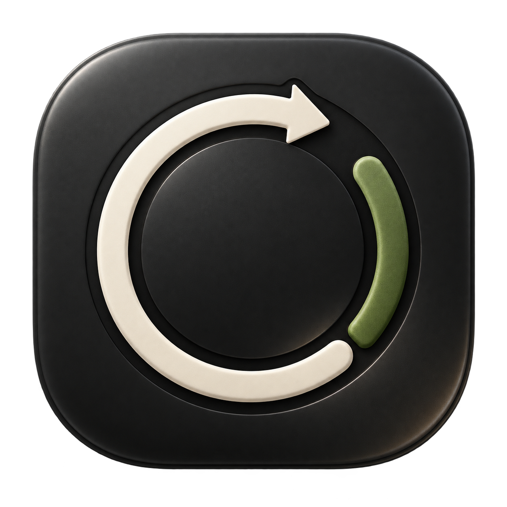
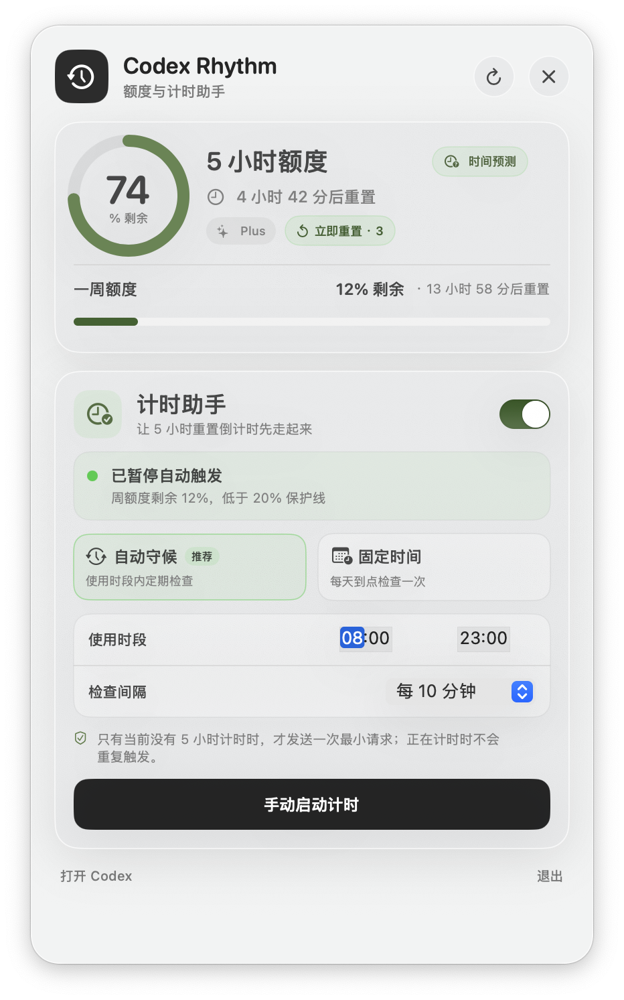

# Codex Rhythm

[](https://www.apple.com/macos/)
[](https://www.swift.org/)
[](LICENSE)

**A native macOS menu-bar companion that keeps Codex quota windows visible and helps start the next five-hour countdown before you need it.**

[简体中文](README.zh-CN.md)

Codex Rhythm combines live quota monitoring, guarded timer automation, banked-reset controls, and three-cycle reset forecasting in a compact frosted-glass control center. It is written in Swift and uses no third-party runtime dependencies.



> Codex Rhythm is an independent community project. It is not affiliated with or endorsed by OpenAI.

<p align="center">
  
</p>

## Why it exists

A newly available five-hour allowance may not begin counting down until Codex is used again. If that first request happens only when focused work starts, the next reset can land later than expected.

Codex Rhythm watches the official quota state. When the five-hour window is genuinely idle, it can send one guarded Codex request so the countdown begins earlier. The goal is simple: move more waiting time into hours when you are not actively using Codex.

## Highlights

- Shows five-hour and weekly remaining quota in the macOS menu bar.
- Refreshes from the current Codex usage service every 30 seconds.
- Falls back to recent local Codex response headers when the network request is unavailable.
- Distinguishes real five-hour windows from the moving placeholder timestamp reported at 0% usage.
- Offers two timer-assistant modes:
  - **Automatic watch** checks at a chosen interval inside an active time range.
  - **Fixed time** checks at one or two chosen times each day.
- Provides an explicit manual “start timer” action.
- Confirms a start from observed quota usage or a stable reset timestamp before reporting success.
- Shows the next three estimated reset times under **Time Forecast**.
- Displays available banked resets and requires confirmation before consuming one.
- Uses native SwiftUI/AppKit, with no analytics, ads, or third-party SDKs.

## Requirements

- macOS 13 Ventura or later.
- Codex desktop or Codex CLI signed in with a ChatGPT account.
- Xcode Command Line Tools when building from source.

Install Apple's command-line tools if needed:

```bash
xcode-select --install
```

## Install from source

From the repository root:

```bash
./scripts/install.sh
```

The installer builds an ad-hoc signed `CodexRhythm.app`, installs it to `~/Applications`, registers a per-user LaunchAgent, and starts the menu-bar app. Administrator privileges are not required.

Running the installer again updates the existing installation:

```bash
./scripts/install.sh
```

To uninstall:

```bash
./scripts/uninstall.sh
```

Diagnostic logs are intentionally left in `~/Library/Logs` after uninstalling.

## Using the timer assistant

The timer assistant is disabled by default. When enabled, it acts only if all safety checks pass:

1. The quota snapshot is fresh and came from the official usage service.
2. No genuine five-hour window is active.
3. Weekly remaining quota is above the protection threshold.
4. The current time matches the configured watch period or fixed-time schedule.
5. The same schedule slot has not already been handled or exhausted its retry limit.

The start request uses the locally installed Codex CLI with ChatGPT authentication, an ephemeral session, and a read-only sandbox. A successful CLI exit is not enough: Codex Rhythm polls the official quota state and confirms the window before marking the action complete.

Tiny requests may still include Codex system context and therefore are not guaranteed to consume a trivial number of input tokens. Window semantics and quota accounting are controlled by the service and may change.

## Time Forecast

Click **Time Forecast** beside the five-hour quota title to see three estimated reset times. The first item uses the confirmed current reset timestamp; later items advance in five-hour steps.

These are estimates. Sleep, network loss, a stopped app, or a delayed next-window trigger can push later resets back.

## Privacy and security

Codex Rhythm reads the existing Codex credentials in `~/.codex/auth.json` to request quota information from `chatgpt.com`. Credentials are held in memory and are never written to project logs. The app has no telemetry or project-owned server.

The optional timer assistant launches the local `codex` executable only when enabled or invoked manually. Review the complete trust model in [SECURITY.md](SECURITY.md).

## Build and test

```bash
./scripts/test.sh
./scripts/build.sh
```

The application is created at:

```text
build/CodexRhythm.app
```

## Project layout

```text
Sources/CodexRhythm/       Layered application source
├── App/                   Entry point and lifecycle coordination
├── Domain/                Quota models and pure parsing
├── Features/              Control center and timer assistant
├── Services/              Codex API and CLI integrations
└── Support/               Shared logging and utilities
Resources/                 Runtime assets such as the application icon
SupportingFiles/           Info.plist and bundle metadata
Tests/CodexRhythmTests/    Deterministic regression tests
scripts/                   Build, install, test, uninstall, and release tools
Documentation/             Architecture, release process, and long-form article
.github/                   CI and contribution templates
```

See [Architecture](Documentation/ARCHITECTURE.md) for dependency boundaries and component responsibilities.

## Contributing

Issues and focused pull requests are welcome. Read [CONTRIBUTING.md](CONTRIBUTING.md) before sharing logs or screenshots; Codex credentials and account identifiers must never be included.

## Compatibility notice

Codex Rhythm relies on interfaces used by current Codex clients. They are not a compatibility promise and can change. The app fails visibly when data cannot be trusted instead of presenting stale information as current.

## License and attribution

Released under the [MIT License](LICENSE). Third-party attribution and project lineage are recorded in [NOTICE](NOTICE).
